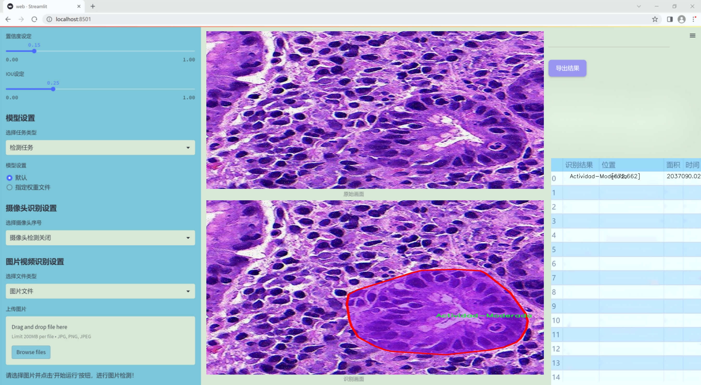
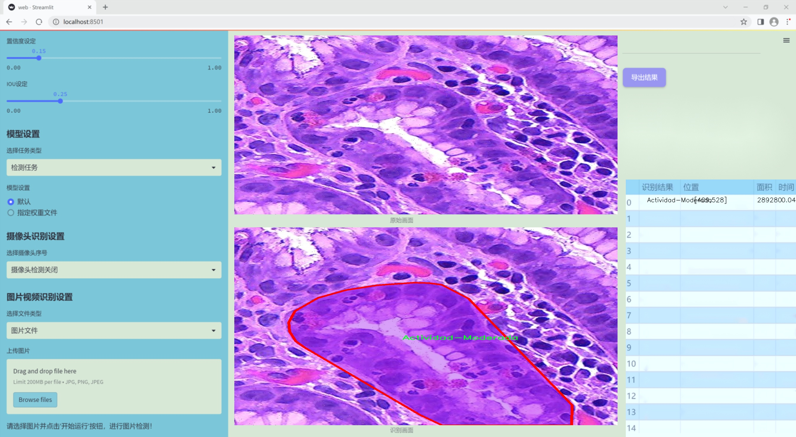
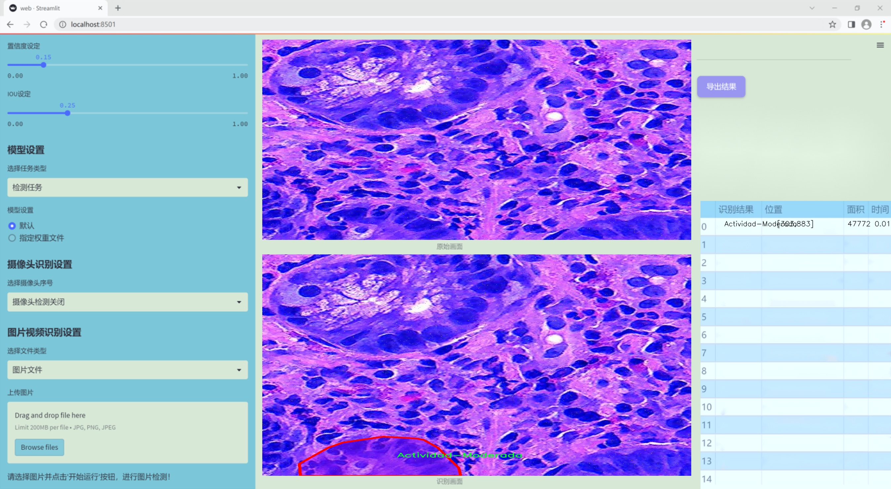
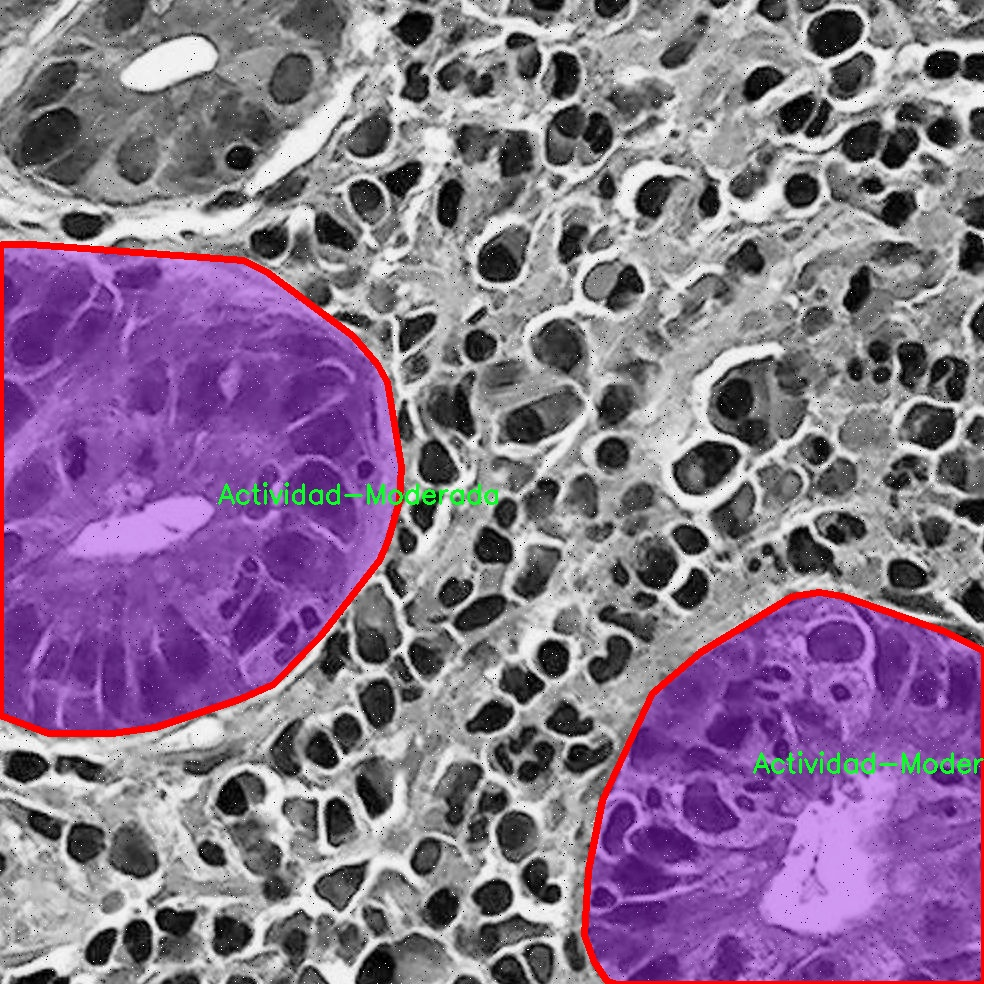
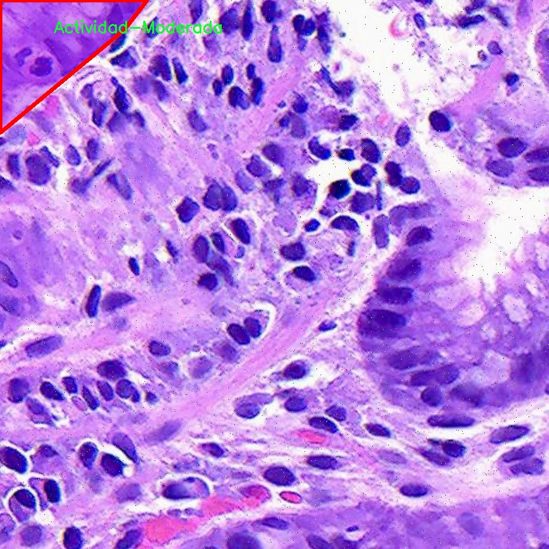
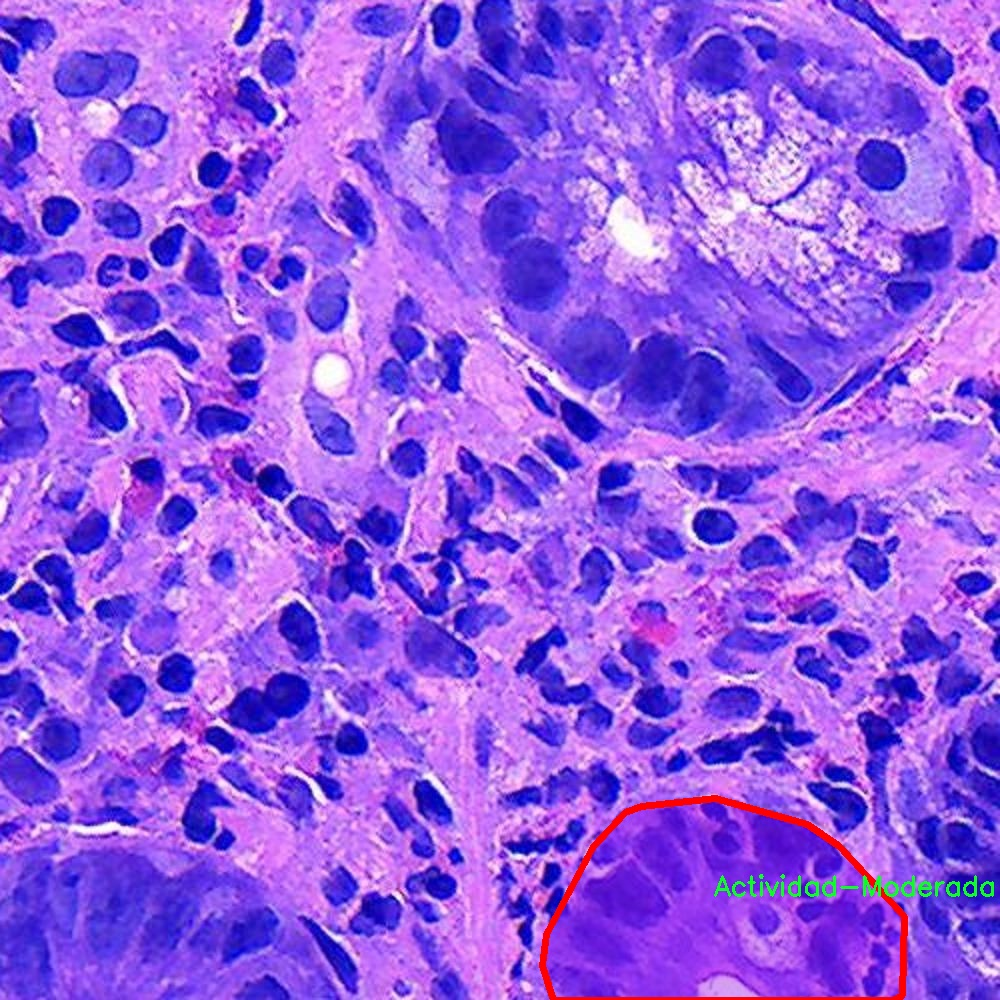
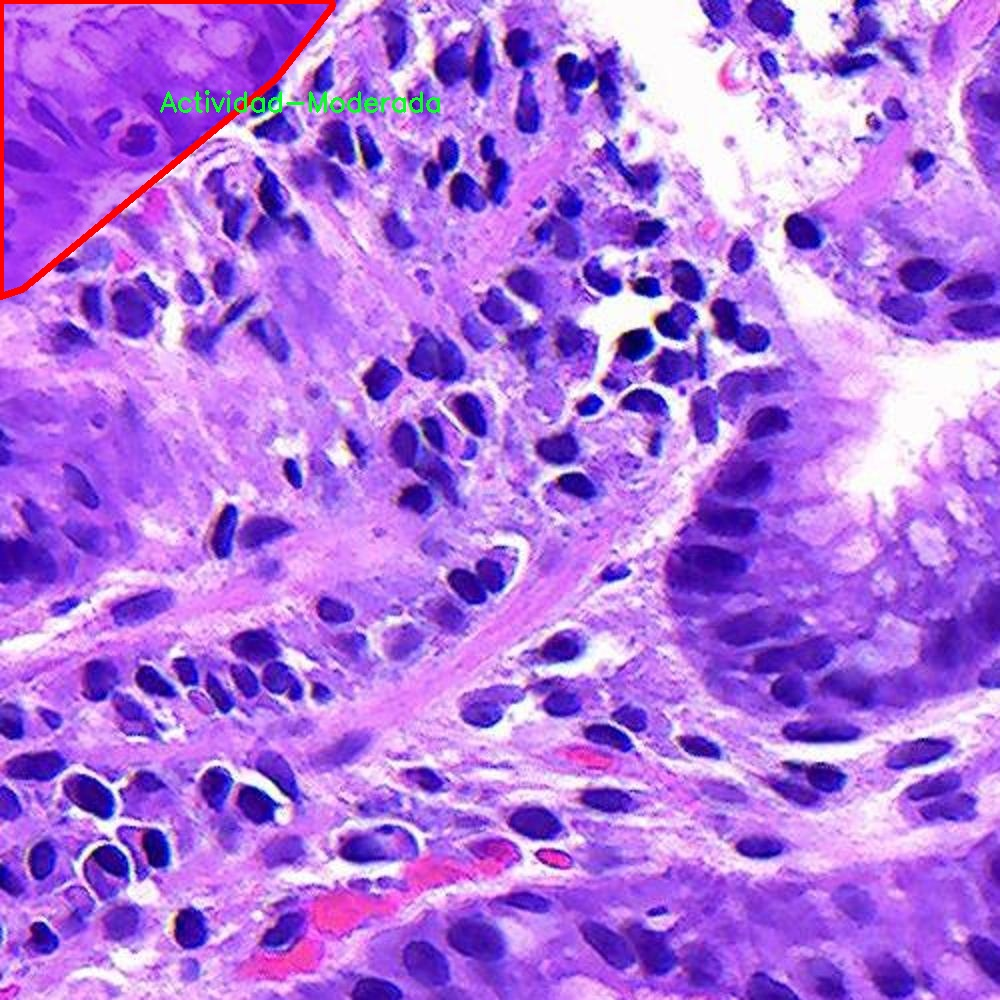
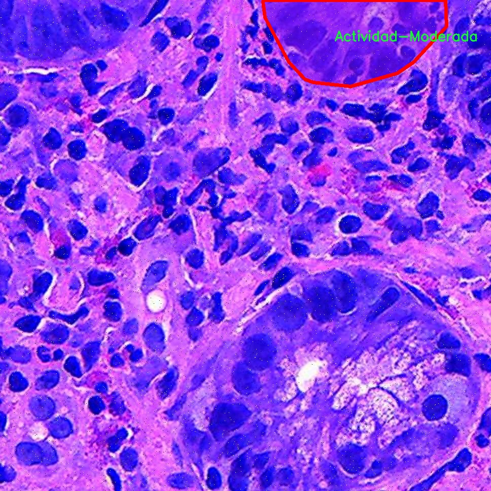

### 1.背景意义

研究背景与意义

胃部病变的早期检测对于降低胃癌及其他相关疾病的发病率具有重要意义。随着生活方式的改变和饮食习惯的多样化，胃部疾病的发生率逐年上升，给患者的健康和生活质量带来了严重影响。因此，开发高效、准确的胃部病变检测系统，能够为临床提供及时的诊断支持，进而改善患者的预后。

在众多的计算机视觉技术中，基于深度学习的目标检测方法因其高效性和准确性而受到广泛关注。YOLO（You Only Look Once）系列模型因其实时检测能力和较高的精度，成为了目标检测领域的主流选择。YOLOv11作为该系列的最新版本，具备更强的特征提取能力和更快的推理速度，适合用于复杂的医学图像分析任务。然而，现有的YOLO模型在处理特定领域的医学图像时，往往面临数据稀缺和标注不均的问题。

本研究旨在基于改进的YOLOv11模型，构建一个针对胃部病变的检测系统。我们将利用Gastrix-inst-seg数据集，该数据集包含1753幅经过精细标注的胃部图像，涵盖了多种病变类型，包括中度活动、重度活动和化生等。通过对数据集的深度分析和处理，我们将实施数据增强技术，以提高模型的泛化能力和鲁棒性。

本项目的意义在于，通过结合先进的深度学习技术与丰富的医学图像数据，提升胃部病变的检测精度，进而为临床医生提供更为可靠的辅助诊断工具。这不仅能够加速胃部疾病的早期发现，还将为相关研究提供数据支持，推动胃部疾病检测技术的发展，最终实现提高患者生存率和生活质量的目标。

### 2.视频效果

[2.1 视频效果](https://www.bilibili.com/video/BV1vVBMYDESX/)

### 3.图片效果







##### [项目涉及的源码数据来源链接](https://kdocs.cn/l/cszuIiCKVNis)**

注意：本项目提供训练的数据集和训练教程,由于版本持续更新,暂不提供权重文件（best.pt）,请按照6.训练教程进行训练后实现上图演示的效果。

### 4.数据集信息

##### 4.1 本项目数据集类别数＆类别名

nc: 3
names: ['Actividad-Moderada', 'Actividad-Severa', 'Metaplasia']


该项目为【图像分割】数据集，请在【训练教程和Web端加载模型教程（第三步）】这一步的时候按照【图像分割】部分的教程来训练

##### 4.2 本项目数据集信息介绍

本项目数据集信息介绍

本项目旨在改进YOLOv11的胃部病变检测系统，所使用的数据集名为“Gastrix-inst-seg”。该数据集专注于胃部病变的自动检测与分类，具有重要的临床应用价值。数据集中包含三种主要类别，分别为“Actividad-Moderada”（中度活动）、“Actividad-Severa”（重度活动）和“Metaplasia”（化生）。这些类别涵盖了胃部病变的不同严重程度和类型，为模型的训练提供了丰富的样本和多样化的特征。

在数据集的构建过程中，研究团队收集了大量的胃部内镜图像，并对其进行了精细的标注和分类。每一张图像都经过专业医生的审核，确保标注的准确性和可靠性。这种高质量的标注不仅提升了数据集的实用性，也为后续的模型训练提供了坚实的基础。数据集中包含的样本数量充足，能够有效支持深度学习模型的训练和验证，确保模型在不同场景下的泛化能力。

此外，数据集的设计考虑到了多样性和代表性，涵盖了不同患者的胃部病变情况，包括不同年龄、性别和病史的患者。这种多样性使得模型能够更好地适应临床实际情况，提高其在真实环境中的应用效果。通过对“Gastrix-inst-seg”数据集的深入分析与训练，期望能够显著提升YOLOv11在胃部病变检测中的准确性和效率，为临床医生提供更为可靠的辅助诊断工具，从而改善患者的治疗效果和生活质量。











### 5.全套项目环境部署视频教程（零基础手把手教学）

[5.1 所需软件PyCharm和Anaconda安装教程（第一步）](https://www.bilibili.com/video/BV1BoC1YCEKi/?spm_id_from=333.999.0.0&vd_source=bc9aec86d164b67a7004b996143742dc)


[5.2 安装Python虚拟环境创建和依赖库安装视频教程（第二步）](https://www.bilibili.com/video/BV1ZoC1YCEBw?spm_id_from=333.788.videopod.sections&vd_source=bc9aec86d164b67a7004b996143742dc)

### 6.改进YOLOv11训练教程和Web_UI前端加载模型教程（零基础手把手教学）

[6.1 改进YOLOv11训练教程和Web_UI前端加载模型教程（第三步）](https://www.bilibili.com/video/BV1BoC1YCEhR?spm_id_from=333.788.videopod.sections&vd_source=bc9aec86d164b67a7004b996143742dc)


按照上面的训练视频教程链接加载项目提供的数据集，运行train.py即可开始训练



     Epoch   gpu_mem       box       obj       cls    labels  img_size
     1/200     20.8G   0.01576   0.01955  0.007536        22      1280: 100%|██████████| 849/849 [14:42<00:00,  1.04s/it]
               Class     Images     Labels          P          R     mAP@.5 mAP@.5:.95: 100%|██████████| 213/213 [01:14<00:00,  2.87it/s]
                 all       3395      17314      0.994      0.957      0.0957      0.0843

     Epoch   gpu_mem       box       obj       cls    labels  img_size
     2/200     20.8G   0.01578   0.01923  0.007006        22      1280: 100%|██████████| 849/849 [14:44<00:00,  1.04s/it]
               Class     Images     Labels          P          R     mAP@.5 mAP@.5:.95: 100%|██████████| 213/213 [01:12<00:00,  2.95it/s]
                 all       3395      17314      0.996      0.956      0.0957      0.0845

     Epoch   gpu_mem       box       obj       cls    labels  img_size
     3/200     20.8G   0.01561    0.0191  0.006895        27      1280: 100%|██████████| 849/849 [10:56<00:00,  1.29it/s]
               Class     Images     Labels          P          R     mAP@.5 mAP@.5:.95: 100%|███████   | 187/213 [00:52<00:00,  4.04it/s]
                 all       3395      17314      0.996      0.957      0.0957      0.0845


###### [项目数据集下载链接](https://kdocs.cn/l/cszuIiCKVNis)

### 7.原始YOLOv11算法讲解

YOLO11采用改进的骨干和颈部架构，增强了特征提取能力，提高了物体检测的精确度和复杂任务的表现。YOLO11引入精炼的架构设计和优化的训练流程，实现更快的处理速度，同时保持精度和性能之间的最佳平衡。通过模型设计的进步，YOLO11m在COCO数据集上实现了更高的均值平均精度（mAP），同时使用比YOLOv8m少22%的参数，使其在不妥协准确性的情况下更加计算高效。YOLO11可以无缝部署在各种环境中，包括边缘设备、云平台以及支持NVIDIA
GPU的系统，确保最大灵活性。无论是物体检测、实例分割、图像分类、姿态估计，还是定向物体检测（OBB），YOLO11都旨在应对多样的计算机视觉挑战。


##### **Ultralytics YOLO11相比于之前版本的主要改进有哪些？**

Ultralytics YOLO11在其前身基础上引入了几项重要进步。主要改进包括：

  1. **增强的特征提取** ：YOLO11采用改进的骨干和颈部架构，增强了特征提取能力，提高了物体检测的精确度。
  2.  **优化的效率和速度** ：精炼的架构设计和优化的训练流程实现了更快的处理速度，同时保持了准确性和性能之间的平衡。
  3.  **更高的准确性与更少的参数** ：YOLO11m在COCO数据集上实现了更高的均值平均精度（mAP），同时使用比YOLOv8m少22%的参数，使其在不妥协准确性的情况下更加计算高效。
  4.  **环境适应性强** ：YOLO11可以在多种环境中部署，包括边缘设备、云平台以及支持NVIDIA GPU的系统。
  5.  **支持广泛的任务** ：YOLO11支持多种计算机视觉任务，如物体检测、实例分割、图像分类、姿态估计和定向物体检测（OBB）。

我们先来看一下其网络结构有什么变化，可以看出，相比较于YOLOv8模型，其将CF2模块改成C3K2，同时在SPPF模块后面添加了一个C2PSA模块，且将YOLOv10的head思想引入到YOLO11的head中，使用深度可分离的方法，减少冗余计算，提高效率。下面我们来详细看一下这两个模块的结构是怎么构成的，以及它们为什么要这样设计


##### C3K2的网络结构

从下面图中我们可以看到，C3K2模块其实就是C2F模块转变出来的，它代码中有一个设置，就是当c3k这个参数为FALSE的时候，C3K2模块就是C2F模块，也就是说它的Bottleneck是普通的Bottleneck；反之当它为true的时候，将Bottleneck模块替换成C3模块。


##### C2PSA的网络结构

` `C2PSA是对 `C2f` 模块的扩展，它结合了PSA(Pointwise Spatial
Attention)块，用于增强特征提取和注意力机制。通过在标准 `C2f` 模块中引入 PSA
块，C2PSA实现了更强大的注意力机制，从而提高了模型对重要特征的捕捉能力。


##### **C2f 模块回顾：**

**** C2f模块是一个更快的 CSP（Cross Stage Partial）瓶颈实现，它通过两个卷积层和多个 Bottleneck
块进行特征提取。相比传统的 CSPNet，C2f 优化了瓶颈层的结构，使得计算速度更快。在 C2f中，`cv1` 是第一个 1x1
卷积，用于减少通道数；`cv2` 是另一个 1x1 卷积，用于恢复输出通道数。而 `n` 是一个包含 Bottleneck 块的数量，用于提取特征。

##### **C2PSA 模块的增强** ：

**C2PSA** 扩展了 C2f，通过引入PSA( **Position-Sensitive Attention)**
，旨在通过多头注意力机制和前馈神经网络来增强特征提取能力。它可以选择性地添加残差结构（shortcut）以优化梯度传播和网络训练效果。同时，使用FFN
可以将输入特征映射到更高维的空间，捕获输入特征的复杂非线性关系，允许模型学习更丰富的特征表示。

##### head部分

YOLO11在head部分的cls分支上使用深度可分离卷积 ，具体代码如下，cv2边界框回归分支，cv3分类分支。

    
    
     self.cv2 = nn.ModuleList(
                nn.Sequential(Conv(x, c2, 3), Conv(c2, c2, 3), nn.Conv2d(c2, 4 * self.reg_max, 1)) for x in ch
            )
            self.cv3 = nn.ModuleList(
                nn.Sequential(
                    nn.Sequential(DWConv(x, x, 3), Conv(x, c3, 1)),
                    nn.Sequential(DWConv(c3, c3, 3), Conv(c3, c3, 1)),
                    nn.Conv2d(c3, self.nc, 1),
                )
                for x in ch
            )


### 8.200+种全套改进YOLOV11创新点原理讲解

#### 8.1 200+种全套改进YOLOV11创新点原理讲解大全

由于篇幅限制，每个创新点的具体原理讲解就不全部展开，具体见下列网址中的改进模块对应项目的技术原理博客网址【Blog】（创新点均为模块化搭建，原理适配YOLOv5~YOLOv11等各种版本）

[改进模块技术原理博客【Blog】网址链接](https://gitee.com/qunmasj/good)


#### 8.2 精选部分改进YOLOV11创新点原理讲解

###### 这里节选部分改进创新点展开原理讲解(完整的改进原理见上图和[改进模块技术原理博客链接](https://gitee.com/qunmasj/good)【如果此小节的图加载失败可以通过CSDN或者Github搜索该博客的标题访问原始博客，原始博客图片显示正常】


### OREPA：在线卷积重参数化
卷积神经网络(CNNs)已经在许多计算机视觉任务的应用成功，包括图像分类、目标检测、语义分割等。精度和模型效率之间的权衡也已被广泛讨论。

一般来说，一个精度较高的模型通常需要一个更复杂的块，一个更宽或更深的结构。然而，这样的模型总是太重，无法部署，特别是在硬件性能有限、需要实时推理的场景下。考虑到效率，更小、更紧凑和更快的模型自然是首选。

为了获得一个部署友好且高精度的模型，有研究者提出了基于结构重参数化的方法来释放性能。在这些方法中，模型在训练阶段和推理阶段有不同的结构。具体来说，使用复杂的训练阶段拓扑，即重参数化的块，来提高性能。训练结束后，通过等效变换将一个复杂的块重参为成一个单一的线性层。重参后的模型通常具有一个整洁架构模型，例如，通常是一个类似VGG的或一个类似ResNet的结构。从这个角度来看，重参化策略可以在不引入额外的推理时间成本的情况下提高模型的性能。


BN层是重构模型的关键组成部分。在一个重新解析块(图1(b))中，在每个卷积层之后立即添加一个BN层。可以观察到，去除这些BN层会导致的性能退化。然而，当考虑到效率时，这种BN层的使用出乎意料地在训练阶段带来了巨大的计算开销。在推理阶段，复杂的块可以被压缩成一个卷积层。但是，在训练过程中，BN层是非线性的，也就是说，它们将特征映射除以它的标准差，这就阻止了合并整个块。因此，存在大量的中间计算操作(large FLOPS)和缓冲特征映射(high memory usage)。更糟糕的是，这么高的训练预算使得很难探索更复杂和可能更强的重参块。很自然地，下面的问题就出现了：

为什么标准化在重参中这么重要？

通过分析和实验，作者认为BN层中的尺度因子最重要，因为它们能够使不同分支的优化方向多样化。

基于观察结果，作者提出了在线重参化(OREPA)(图1(c))，这是一个两阶段的pipeline，使之能够简化复杂的training-time re-param block。

在第一阶段，block linearization，去除所有的非线性BN层，并引入线性缩放层。这些层与BN层具有相似的性质，因此它们使不同分支的优化多样化。此外，这些层都是线性的，可以在训练过程中合并成卷积层。

第二阶段，block squeezing，将复杂的线性块简化为单一的卷积层。OREPA通过减少由中间计算层引起的计算和存储开销，显著降低了训练成本，对性能只有非常小的影响。

此外，高效化使得探索更复杂的重参化拓扑成为可能。为了验证这一点，作者进一步提出了几个重参化的组件，以获得更好的性能。

在ImageNet分类任务上评估了所提出的OREPA。与最先进的修复模型相比，OREPA将额外的训练时间GPU内存成本降低了65%到75%，并将训练过程加快了1.5-2.3倍。同时，OREPA-ResNet和OREPA-VGG的性能始终优于+0.2%∼+0.6%之前的DBB和RepVGG方法。同时作者还评估了在下游任务上的OREPA，即目标检测和语义分割。作者发现OREPA可以在这些任务上也可以带来性能的提高。

提出了在线卷积重参化(OREPA)策略，这极大地提高了重参化模型的训练效率，并使探索更强的重参化块成为可能；

通过对重参化模型工作机制的分析，用引入的线性尺度层代替BN层，这仍然提供了不同的优化方向，并保持了表示能力;

在各种视觉任务上的实验表明，OREPA在准确性和训练效率方面都优于以前的重参化模型(DBB/RepVGG)。


#### 结构重参化
结构重参化最近被重视并应用于许多计算机视觉任务，如紧凑模型设计、架构搜索和剪枝。重参化意味着不同的架构可以通过参数的等价转换来相互转换。例如，1×1卷积的一个分支和3×3卷积的一个分支，可以转移到3×3卷积的单个分支中。在训练阶段，设计了多分支和多层拓扑来取代普通的线性层(如conv或全连接层)来增强模型。Cao等讨论了如何在训练过程中合并深度可分离卷积核。然后在推理过程中，将训练时间的复杂模型转移到简单模型中，以便于更快的推理。

在受益于复杂的training-time拓扑，同时，当前的重参化方法训练使用不可忽略的额外计算成本。当块变得更复杂以变得更强的表示时，GPU内存利用率和训练时间将会越来越长，最终走向不可接受。与以往的重参化方法不同，本文更多地关注训练成本。提出了一种通用的在线卷积重参化策略，使training-time的结构重参化成为可能。


#### Normalization
BN被提出来缓解训练非常深度神经网络时的梯度消失问题。人们认为BN层是非常重要的，因为它们平滑了损失。最近关于无BN神经网络的研究声称，BN层并不是不可或缺的。通过良好的初始化和适当的正则化，可以优雅地去除BN层。

对于重参化模型，作者认为重参化块中的BN层是关键的。无BN的变体将会出现性能下降。然而，BN层是非线性的，也就是说，它们将特征图除以它的标准差，这阻止了在线合并块。为了使在线重参化可行，作者去掉了重参块中的所有BN层，并引入了BN层的线性替代方法，即线性缩放层。

#### 卷积分解
标准卷积层计算比较密集，导致大的FLOPs和参数量。因此，卷积分解方法被提出，并广泛应用于移动设备的轻量化模型中。重参化方法也可以看作是卷积分解的某种形式，但它更倾向于更复杂的拓扑结构。本文的方法的不同之处在于，在kernel-level上分解卷积，而不是在structure level。

#### 在线重参化
在本节中，首先，分析了关键组件，即重参化模型中的BN层，在此基础上提出了在线重参化(OREPA)，旨在大大减少再参数化模型的训练时间预算。OREPA能够将复杂的训练时间块简化为一个卷积层，并保持了较高的精度。

OREPA的整体pipeline如图所示，它包括一个Block Linearization阶段和一个Block Squeezing阶段。


参考该博客通过分析多层和多分支结构的优化多样性，深入研究了重参化的有效性，并证明了所提出的线性缩放层和BN层具有相似的效果。

最后，随着训练预算的减少，进一步探索了更多的组件，以实现更强的重参化模型，成本略有增加。

#### 重参化中的Normalization
作者认为中间BN层是重参化过程中多层和多分支结构的关键组成部分。以SoTA模型DBB和RepVGG为例，去除这些层会导致严重的性能下降，如表1所示。


这种观察结果也得到了Ding等人的实验支持。因此，作者认为中间的BN层对于重参化模型的性能是必不可少的。

然而，中间BN层的使用带来了更高的训练预算。作者注意到，在推理阶段，重参化块中的所有中间操作都是线性的，因此可以合并成一个卷积层，从而形成一个简单的结构。

但在训练过程中，BN层是非线性的，即它们将特征映射除以其标准差。因此，中间操作应该单独计算，这将导致更高的计算和内存成本。更糟糕的是，如此高的成本将阻止探索更强大的训练模块。

#### Block Linearization
如3.1中所述，中间的BN层阻止了在训练过程中合并单独的层。然而，由于性能问题，直接删除它们并不简单。为了解决这一困境，作者引入了channel级线性尺度操作作为BN的线性替代方法。

缩放层包含一个可学习的向量，它在通道维度中缩放特征映射。线性缩放层具有与BN层相似的效果，它们都促进多分支向不同的方向进行优化，这是重参化时性能提高的关键。除了对性能的影响外，线性缩放层还可以在训练过程中进行合并，使在线重参化成为可能。


基于线性缩放层，作者修改了重参化块，如图所示。具体来说，块的线性化阶段由以下3个步骤组成：

首先，删除了所有的非线性层，即重参化块中的BN层

其次，为了保持优化的多样性，在每个分支的末尾添加了一个缩放层，这是BN的线性替代方法

最后，为了稳定训练过程，在所有分支的添加后添加一个BN层。

一旦完成线性化阶段，在重参化块中只存在线性层，这意味着可以在训练阶段合并块中的所有组件。

#### Block Squeezing
Block Squeezing步骤将计算和内存昂贵的中间特征映射上的操作转换为更经济的kernel上的操作。这意味着在计算和内存方面从减少到，其中、是特征图和卷积核的空间尺寸。

一般来说，无论线性重参化块是多么复杂，以下2个属性始终成立：

Block中的所有线性层，例如深度卷积、平均池化和所提出的线性缩放，都可以用带有相应参数的退化卷积层来表示;

Block可以由一系列并行分支表示，每个分支由一系列卷积层组成。

有了上述两个特性，如果可以将

多层（即顺序结构）

多分支（即并行结构）

简化为单一卷积，就可以压缩一个块。在下面的部分中，将展示如何简化顺序结构(图(a))和并行结构(图(b))。


### 9.系统功能展示

图9.1.系统支持检测结果表格显示

  图9.2.系统支持置信度和IOU阈值手动调节

  图9.3.系统支持自定义加载权重文件best.pt(需要你通过步骤5中训练获得)

  图9.4.系统支持摄像头实时识别

  图9.5.系统支持图片识别

  图9.6.系统支持视频识别

  图9.7.系统支持识别结果文件自动保存

  图9.8.系统支持Excel导出检测结果数据


### 10. YOLOv11核心改进源码讲解

#### 10.1 repvit.py

以下是对代码的逐文件分析，保留了最核心的部分，并添加了详细的中文注释。

```python
import torch.nn as nn
import numpy as np
from timm.models.layers import SqueezeExcite
import torch

# 定义可导出的模型名称
__all__ = ['repvit_m0_9', 'repvit_m1_0', 'repvit_m1_1', 'repvit_m1_5', 'repvit_m2_3']

def replace_batchnorm(net):
    """
    替换网络中的 BatchNorm2d 层为 Identity 层
    主要用于模型推理时的优化
    """
    for child_name, child in net.named_children():
        if hasattr(child, 'fuse_self'):
            fused = child.fuse_self()  # 融合卷积和批归一化层
            setattr(net, child_name, fused)
            replace_batchnorm(fused)
        elif isinstance(child, torch.nn.BatchNorm2d):
            setattr(net, child_name, torch.nn.Identity())  # 替换为 Identity
        else:
            replace_batchnorm(child)

def _make_divisible(v, divisor, min_value=None):
    """
    确保所有层的通道数是可被 divisor 整除的
    :param v: 输入的通道数
    :param divisor: 除数
    :param min_value: 最小值
    :return: 调整后的通道数
    """
    if min_value is None:
        min_value = divisor
    new_v = max(min_value, int(v + divisor / 2) // divisor * divisor)
    if new_v < 0.9 * v:  # 确保不减少超过 10%
        new_v += divisor
    return new_v

class Conv2d_BN(torch.nn.Sequential):
    """
    带有 BatchNorm 的卷积层
    """
    def __init__(self, a, b, ks=1, stride=1, pad=0, dilation=1,
                 groups=1, bn_weight_init=1):
        super().__init__()
        self.add_module('c', torch.nn.Conv2d(
            a, b, ks, stride, pad, dilation, groups, bias=False))
        self.add_module('bn', torch.nn.BatchNorm2d(b))
        torch.nn.init.constant_(self.bn.weight, bn_weight_init)  # 初始化 BN 权重
        torch.nn.init.constant_(self.bn.bias, 0)  # 初始化 BN 偏置

    @torch.no_grad()
    def fuse_self(self):
        """
        融合卷积层和 BatchNorm 层为单一卷积层
        """
        c, bn = self._modules.values()
        w = bn.weight / (bn.running_var + bn.eps)**0.5  # 计算新的权重
        w = c.weight * w[:, None, None, None]  # 调整权重形状
        b = bn.bias - bn.running_mean * bn.weight / (bn.running_var + bn.eps)**0.5  # 计算新的偏置
        m = torch.nn.Conv2d(w.size(1) * self.c.groups, w.size(0), w.shape[2:], 
                             stride=self.c.stride, padding=self.c.padding, 
                             dilation=self.c.dilation, groups=self.c.groups,
                             device=c.weight.device)
        m.weight.data.copy_(w)  # 复制权重
        m.bias.data.copy_(b)  # 复制偏置
        return m

class Residual(torch.nn.Module):
    """
    残差连接模块
    """
    def __init__(self, m, drop=0.):
        super().__init__()
        self.m = m  # 模块
        self.drop = drop  # 丢弃率

    def forward(self, x):
        """
        前向传播
        """
        if self.training and self.drop > 0:
            return x + self.m(x) * torch.rand(x.size(0), 1, 1, 1,
                                              device=x.device).ge_(self.drop).div(1 - self.drop).detach()
        else:
            return x + self.m(x)  # 残差连接

class RepViTBlock(nn.Module):
    """
    RepViT 模块
    """
    def __init__(self, inp, hidden_dim, oup, kernel_size, stride, use_se, use_hs):
        super(RepViTBlock, self).__init__()
        assert stride in [1, 2]
        self.identity = stride == 1 and inp == oup  # 判断是否为身份连接
        assert(hidden_dim == 2 * inp)  # 隐藏层维度是输入维度的两倍

        if stride == 2:
            # 2倍下采样
            self.token_mixer = nn.Sequential(
                Conv2d_BN(inp, inp, kernel_size, stride, (kernel_size - 1) // 2, groups=inp),
                SqueezeExcite(inp, 0.25) if use_se else nn.Identity(),
                Conv2d_BN(inp, oup, ks=1, stride=1, pad=0)
            )
            self.channel_mixer = Residual(nn.Sequential(
                Conv2d_BN(oup, 2 * oup, 1, 1, 0),
                nn.GELU() if use_hs else nn.GELU(),
                Conv2d_BN(2 * oup, oup, 1, 1, 0, bn_weight_init=0),
            ))
        else:
            # 1倍下采样
            assert(self.identity)
            self.token_mixer = nn.Sequential(
                RepVGGDW(inp),
                SqueezeExcite(inp, 0.25) if use_se else nn.Identity(),
            )
            self.channel_mixer = Residual(nn.Sequential(
                Conv2d_BN(inp, hidden_dim, 1, 1, 0),
                nn.GELU() if use_hs else nn.GELU(),
                Conv2d_BN(hidden_dim, oup, 1, 1, 0, bn_weight_init=0),
            ))

    def forward(self, x):
        """
        前向传播
        """
        return self.channel_mixer(self.token_mixer(x))

class RepViT(nn.Module):
    """
    RepViT 模型
    """
    def __init__(self, cfgs):
        super().__init__()
        self.cfgs = cfgs  # 配置参数
        input_channel = self.cfgs[0][2]  # 输入通道数
        patch_embed = torch.nn.Sequential(
            Conv2d_BN(3, input_channel // 2, 3, 2, 1), 
            torch.nn.GELU(),
            Conv2d_BN(input_channel // 2, input_channel, 3, 2, 1)
        )
        layers = [patch_embed]  # 初始化层
        block = RepViTBlock  # 模块类型
        for k, t, c, use_se, use_hs, s in self.cfgs:
            output_channel = _make_divisible(c, 8)  # 确保输出通道数可被8整除
            exp_size = _make_divisible(input_channel * t, 8)  # 扩展通道数
            layers.append(block(input_channel, exp_size, output_channel, k, s, use_se, use_hs))
            input_channel = output_channel  # 更新输入通道数
        self.features = nn.ModuleList(layers)  # 存储所有层
        self.channel = [i.size(1) for i in self.forward(torch.randn(1, 3, 640, 640))]  # 记录通道数

    def forward(self, x):
        """
        前向传播
        """
        input_size = x.size(2)
        scale = [4, 8, 16, 32]  # 下采样比例
        features = [None, None, None, None]
        for f in self.features:
            x = f(x)
            if input_size // x.size(2) in scale:
                features[scale.index(input_size // x.size(2))] = x  # 记录特征
        return features

    def switch_to_deploy(self):
        """
        切换到推理模式，替换 BatchNorm
        """
        replace_batchnorm(self)

def update_weight(model_dict, weight_dict):
    """
    更新模型权重
    :param model_dict: 模型权重字典
    :param weight_dict: 新权重字典
    :return: 更新后的模型权重字典
    """
    idx, temp_dict = 0, {}
    for k, v in weight_dict.items():
        if k in model_dict.keys() and np.shape(model_dict[k]) == np.shape(v):
            temp_dict[k] = v
            idx += 1
    model_dict.update(temp_dict)  # 更新权重
    print(f'loading weights... {idx}/{len(model_dict)} items')
    return model_dict

def repvit_m2_3(weights=''):
    """
    构建 RepViT 模型
    :param weights: 权重文件路径
    :return: RepViT 模型
    """
    cfgs = [
        # k, t, c, SE, HS, s 
        [3,   2,  80, 1, 0, 1],
        [3,   2,  80, 0, 0, 1],
        # ... 省略其他配置
        [3,   2, 640, 0, 1, 2],
        [3,   2, 640, 1, 1, 1],
        [3,   2, 640, 0, 1, 1],
    ]
    model = RepViT(cfgs)  # 创建模型
    if weights:
        model.load_state_dict(update_weight(model.state_dict(), torch.load(weights)['model']))  # 加载权重
    return model

if __name__ == '__main__':
    model = repvit_m2_3('repvit_m2_3_distill_450e.pth')  # 初始化模型
    inputs = torch.randn((1, 3, 640, 640))  # 创建输入
    res = model(inputs)  # 前向传播
    for i in res:
        print(i.size())  # 输出特征图的尺寸
```

### 代码分析总结
1. **模块结构**：代码定义了多个类和函数，构建了一个深度学习模型的框架，主要用于图像处理。
2. **模型组件**：包括卷积层、批归一化层、残差连接、RepViT模块等，构成了模型的基本单元。
3. **权重更新**：提供了更新模型权重的功能，确保模型能够加载预训练的权重。
4. **推理优化**：通过替换 BatchNorm 层为 Identity 层来优化推理速度。

以上是对代码的核心部分进行了提炼和详细注释，便于理解和后续使用。

该文件 `repvit.py` 实现了一个基于深度学习的模型，主要用于图像处理任务。它使用了 PyTorch 框架，并且结合了多种现代神经网络技术，如深度可分离卷积、残差连接和 Squeeze-and-Excitation 模块。以下是对文件中主要部分的逐步分析。

首先，文件导入了必要的库，包括 PyTorch 的神经网络模块、NumPy 和 timm 库中的 SqueezeExcite 层。接着，定义了一个 `__all__` 列表，列出了可导出的模型函数。

`replace_batchnorm` 函数用于替换网络中的 BatchNorm 层，通常在模型推理时将 BatchNorm 层融合为卷积层，以提高推理速度。该函数递归遍历网络的所有子模块，如果找到 BatchNorm 层，则将其替换为身份映射（`torch.nn.Identity()`），以便在推理时不再使用 BatchNorm。

`_make_divisible` 函数确保所有层的通道数都是可被 8 整除的，这对于某些模型的结构是必要的，尤其是在使用 MobileNet 结构时。

接下来定义了几个类。`Conv2d_BN` 类是一个包含卷积层和 BatchNorm 层的顺序容器，初始化时可以设置卷积参数，并对 BatchNorm 的权重进行初始化。它还包含一个 `fuse_self` 方法，用于将卷积和 BatchNorm 层融合为一个卷积层，以减少计算量。

`Residual` 类实现了残差连接的功能，允许在训练期间随机丢弃一些输入，以增加模型的鲁棒性。它同样有一个 `fuse_self` 方法，用于融合内部的卷积层。

`RepVGGDW` 类是一个特殊的卷积模块，包含深度可分离卷积和一个 1x1 卷积。它的前向传播将两个卷积的输出相加，并加上输入的残差。

`RepViTBlock` 类实现了一个包含多个卷积层的模块，支持通道混合和标记混合。它根据步幅的不同选择不同的结构。

`RepViT` 类是整个模型的核心，负责构建网络的结构。它根据传入的配置参数（如卷积核大小、扩展比例、输出通道数等）构建多个 `RepViTBlock`，并将其组织成一个序列。模型的前向传播会返回不同尺度的特征图。

在模型构建完成后，提供了多个函数（如 `repvit_m0_9`, `repvit_m1_0` 等）用于实例化不同配置的 RepViT 模型。这些函数会根据预定义的配置参数创建模型，并可以选择加载预训练权重。

最后，在 `__main__` 部分，示例代码展示了如何实例化一个模型并进行前向传播，输出特征图的尺寸。

整体来看，这个文件实现了一个灵活且高效的视觉模型，适用于多种计算机视觉任务，尤其是在图像分类和目标检测等领域。通过使用现代的深度学习技术，模型在保持高效性的同时，也能获得较好的性能。

#### 10.2 TransNext.py

以下是保留的核心代码部分，并添加了详细的中文注释：

```python
try:
    # 尝试导入 swattention 模块和 TransNext_cuda 中的所有内容
    import swattention
    from ultralytics.nn.backbone.TransNeXt.TransNext_cuda import *
except ImportError as e:
    # 如果导入失败（例如模块不存在），则导入 TransNext_native 中的所有内容
    from ultralytics.nn.backbone.TransNeXt.TransNext_native import *
    pass
```

### 注释说明：
1. `try:` 块用于尝试执行一段代码，如果代码块中的任何导入失败，将会引发 `ImportError` 异常。
2. `import swattention`：尝试导入 `swattention` 模块，这个模块可能是实现某种注意力机制的库。
3. `from ultralytics.nn.backbone.TransNeXt.TransNext_cuda import *`：尝试从 `TransNext_cuda` 模块中导入所有内容。这个模块可能是一个与 CUDA 相关的深度学习模型实现，利用 GPU 加速。
4. `except ImportError as e:`：如果在 `try` 块中发生 `ImportError`，则执行 `except` 块中的代码。
5. `from ultralytics.nn.backbone.TransNeXt.TransNext_native import *`：在导入失败的情况下，从 `TransNext_native` 模块中导入所有内容。这个模块可能是一个不依赖于 CUDA 的实现，适用于没有 GPU 的环境。
6. `pass`：在 `except` 块中，`pass` 表示什么都不做，继续执行后续代码。

这个程序文件名为 `TransNext.py`，主要功能是导入一个名为 `swattention` 的模块以及 `TransNext_cuda` 或 `TransNext_native` 中的内容。首先，程序尝试导入 `swattention` 模块，并且从 `ultralytics.nn.backbone.TransNeXt` 路径下导入 `TransNext_cuda`。这个模块可能是与深度学习相关的，特别是在处理图像或视频数据时。

如果在导入 `swattention` 或 `TransNext_cuda` 时发生 `ImportError`（即找不到模块），程序会捕获这个异常，并尝试导入 `TransNext_native`。这种做法通常是为了确保程序在不同的环境中都能正常运行，因为有时某些模块可能在特定的硬件或软件配置下不可用。

通过这种方式，程序提供了一种灵活的导入机制，确保即使在某些依赖项缺失的情况下，仍然能够继续执行其他功能。这种异常处理的策略在开发深度学习模型时非常常见，因为模型的实现可能依赖于特定的库或硬件加速。

#### 10.3 revcol.py

以下是经过简化和注释的核心代码部分，主要保留了反向传播和前向传播的逻辑。

```python
import torch
import torch.nn as nn

class ReverseFunction(torch.autograd.Function):
    @staticmethod
    def forward(ctx, run_functions, alpha, *args):
        # 保存运行的函数和alpha参数
        ctx.run_functions = run_functions
        ctx.alpha = alpha

        # 解包输入参数
        x, c0, c1, c2, c3 = args
        
        # 使用无梯度计算来进行前向传播
        with torch.no_grad():
            # 依次调用每个函数并计算输出
            c0 = run_functions[0](x, c1) + c0 * alpha[0]
            c1 = run_functions[1](c0, c2) + c1 * alpha[1]
            c2 = run_functions[2](c1, c3) + c2 * alpha[2]
            c3 = run_functions[3](c2, None) + c3 * alpha[3]

        # 保存用于反向传播的张量
        ctx.save_for_backward(x, c0, c1, c2, c3)
        return x, c0, c1, c2, c3

    @staticmethod
    def backward(ctx, *grad_outputs):
        # 从上下文中获取保存的张量
        x, c0, c1, c2, c3 = ctx.saved_tensors
        run_functions = ctx.run_functions
        alpha = ctx.alpha
        
        # 解包梯度输出
        gx_right, g0_right, g1_right, g2_right, g3_right = grad_outputs
        
        # 反向传播计算
        g3_up = g3_right
        g3_left = g3_up * alpha[3]  # shortcut
        oup3 = run_functions[3](c2, None)
        torch.autograd.backward(oup3, g3_up, retain_graph=True)
        
        # 计算特征反向
        c3_left = (1 / alpha[3]) * (c3 - oup3)
        g2_up = g2_right + c2.grad
        g2_left = g2_up * alpha[2]  # shortcut

        # 继续反向传播
        c2_left = (1 / alpha[2]) * (c2 - run_functions[2](c1, c3_left))
        g1_up = g1_right + c1.grad
        g1_left = g1_up * alpha[1]  # shortcut

        # 最后一步反向传播
        g0_up = g0_right + c0.grad
        g0_left = g0_up * alpha[0]  # shortcut
        
        # 返回梯度
        return None, None, gx_up, g0_left, g1_left, g2_left, g3_left

class SubNet(nn.Module):
    def __init__(self, channels, layers, kernel, first_col, save_memory) -> None:
        super().__init__()
        # 初始化网络层
        self.level0 = Level(0, channels, layers, kernel, first_col)
        self.level1 = Level(1, channels, layers, kernel, first_col)
        self.level2 = Level(2, channels, layers, kernel, first_col)
        self.level3 = Level(3, channels, layers, kernel, first_col)

    def forward(self, *args):
        # 前向传播逻辑
        if self.save_memory:
            return self._forward_reverse(*args)
        else:
            return self._forward_nonreverse(*args)

    def _forward_nonreverse(self, *args):
        # 非反向传播的前向计算
        x, c0, c1, c2, c3 = args
        c0 = self.level0(x, c1)
        c1 = self.level1(c0, c2)
        c2 = self.level2(c1, c3)
        c3 = self.level3(c2, None)
        return c0, c1, c2, c3

    def _forward_reverse(self, *args):
        # 反向传播的前向计算
        local_funs = [self.level0, self.level1, self.level2, self.level3]
        alpha = [self.alpha0, self.alpha1, self.alpha2, self.alpha3]
        return ReverseFunction.apply(local_funs, alpha, *args)

class RevCol(nn.Module):
    def __init__(self, kernel='C2f', channels=[32, 64, 96, 128], layers=[2, 3, 6, 3], num_subnet=5, save_memory=True) -> None:
        super().__init__()
        self.num_subnet = num_subnet
        self.channels = channels
        self.layers = layers

        # 初始化网络的stem部分
        self.stem = Conv(3, channels[0], k=4, s=4, p=0)

        # 初始化多个子网络
        for i in range(num_subnet):
            first_col = (i == 0)
            self.add_module(f'subnet{str(i)}', SubNet(channels, layers, kernel, first_col, save_memory=save_memory))

    def forward(self, x):
        # 前向传播逻辑
        c0, c1, c2, c3 = 0, 0, 0, 0
        x = self.stem(x)        
        for i in range(self.num_subnet):
            c0, c1, c2, c3 = getattr(self, f'subnet{str(i)}')(x, c0, c1, c2, c3)       
        return [c0, c1, c2, c3]
```

### 代码说明：
1. **ReverseFunction**: 这是一个自定义的反向传播函数，使用了 PyTorch 的 `torch.autograd.Function`。它实现了前向传播和反向传播的逻辑。
   - `forward` 方法计算前向传播的输出，并保存中间结果以便反向传播使用。
   - `backward` 方法计算梯度，使用保存的中间结果和输入的梯度输出进行反向传播。

2. **SubNet**: 这是一个子网络类，包含多个层级（Level）。根据 `save_memory` 参数选择是否使用反向传播优化。

3. **RevCol**: 这是主网络类，初始化多个子网络，并在前向传播中依次调用它们。通过 `stem` 层处理输入数据。

这个简化版本保留了反向传播的核心逻辑和网络结构，便于理解和使用。

这个程序文件 `revcol.py` 是一个基于 PyTorch 的深度学习模型实现，主要用于图像处理任务。它实现了一个名为 `RevCol` 的网络结构，结合了反向传播和特征融合的机制。以下是对代码的详细说明。

首先，文件导入了必要的 PyTorch 库和一些自定义模块。`Conv`、`C2f`、`C3`、`C3Ghost` 和 `C3k2` 是在其他模块中定义的卷积和块结构，可能用于构建网络的不同层。

接下来，定义了一些辅助函数。`get_gpu_states` 函数用于获取指定 GPU 设备的随机数生成器状态，`get_gpu_device` 函数则从输入的张量中提取出所有使用的 GPU 设备。`set_device_states` 函数用于设置 CPU 和 GPU 的随机数生成器状态。`detach_and_grad` 函数用于分离输入张量并启用梯度计算，确保在反向传播时不会影响原始张量的计算图。`get_cpu_and_gpu_states` 函数则返回当前 CPU 和 GPU 的随机数生成器状态。

接下来定义了一个名为 `ReverseFunction` 的类，继承自 `torch.autograd.Function`，实现了自定义的前向和反向传播逻辑。在 `forward` 方法中，首先保存输入和一些状态，然后通过多个层的函数计算输出。`backward` 方法则实现了反向传播的逻辑，计算梯度并处理各层之间的依赖关系。

`Fusion` 类用于实现特征融合，包含下采样和上采样的操作。`Level` 类表示网络的一个层级，包含融合和卷积模块。`SubNet` 类则是一个子网络，包含多个层级的组合，并实现了正向传播的两种方式：非反向传播和反向传播。

`RevCol` 类是整个模型的主体，初始化时定义了多个子网络和卷积层。它的 `forward` 方法负责将输入数据通过所有子网络进行处理，并返回最终的特征输出。

整个代码结构清晰，模块化设计使得各个部分易于理解和维护。该模型的设计理念在于通过反向传播和特征融合来提高网络的性能，同时提供了节省内存的选项。通过使用自定义的反向传播函数，模型能够在训练过程中更有效地处理梯度计算，适应更复杂的任务需求。

#### 10.4 SwinTransformer.py

以下是代码中最核心的部分，并附上详细的中文注释：

```python
import torch
import torch.nn as nn
import torch.nn.functional as F
import numpy as np
from timm.models.layers import DropPath, to_2tuple, trunc_normal_

class Mlp(nn.Module):
    """ 多层感知机 (MLP) 模块。"""

    def __init__(self, in_features, hidden_features=None, out_features=None, act_layer=nn.GELU, drop=0.):
        super().__init__()
        out_features = out_features or in_features  # 输出特征数，如果未指定则与输入特征数相同
        hidden_features = hidden_features or in_features  # 隐藏层特征数，如果未指定则与输入特征数相同
        self.fc1 = nn.Linear(in_features, hidden_features)  # 第一层线性变换
        self.act = act_layer()  # 激活函数
        self.fc2 = nn.Linear(hidden_features, out_features)  # 第二层线性变换
        self.drop = nn.Dropout(drop)  # Dropout层

    def forward(self, x):
        """ 前向传播函数。"""
        x = self.fc1(x)  # 线性变换
        x = self.act(x)  # 激活
        x = self.drop(x)  # Dropout
        x = self.fc2(x)  # 线性变换
        x = self.drop(x)  # Dropout
        return x

class WindowAttention(nn.Module):
    """ 基于窗口的多头自注意力 (W-MSA) 模块。"""

    def __init__(self, dim, window_size, num_heads, qkv_bias=True, qk_scale=None, attn_drop=0., proj_drop=0.):
        super().__init__()
        self.dim = dim  # 输入通道数
        self.window_size = window_size  # 窗口大小
        self.num_heads = num_heads  # 注意力头数
        head_dim = dim // num_heads  # 每个头的维度
        self.scale = qk_scale or head_dim ** -0.5  # 缩放因子

        # 定义相对位置偏置参数表
        self.relative_position_bias_table = nn.Parameter(
            torch.zeros((2 * window_size[0] - 1) * (2 * window_size[1] - 1), num_heads))  # 位置偏置表

        # 计算每个token的相对位置索引
        coords_h = torch.arange(self.window_size[0])
        coords_w = torch.arange(self.window_size[1])
        coords = torch.stack(torch.meshgrid([coords_h, coords_w]))  # 生成网格坐标
        coords_flatten = torch.flatten(coords, 1)  # 展平坐标
        relative_coords = coords_flatten[:, :, None] - coords_flatten[:, None, :]  # 计算相对坐标
        relative_coords = relative_coords.permute(1, 2, 0).contiguous()  # 调整维度
        relative_coords[:, :, 0] += self.window_size[0] - 1  # 偏移
        relative_coords[:, :, 1] += self.window_size[1] - 1
        relative_coords[:, :, 0] *= 2 * self.window_size[1] - 1
        relative_position_index = relative_coords.sum(-1)  # 计算相对位置索引
        self.register_buffer("relative_position_index", relative_position_index)  # 注册为缓冲区

        self.qkv = nn.Linear(dim, dim * 3, bias=qkv_bias)  # 线性变换生成q, k, v
        self.attn_drop = nn.Dropout(attn_drop)  # 注意力权重的Dropout
        self.proj = nn.Linear(dim, dim)  # 输出线性变换
        self.proj_drop = nn.Dropout(proj_drop)  # 输出的Dropout
        trunc_normal_(self.relative_position_bias_table, std=.02)  # 初始化相对位置偏置
        self.softmax = nn.Softmax(dim=-1)  # Softmax层

    def forward(self, x, mask=None):
        """ 前向传播函数。"""
        B_, N, C = x.shape  # B_: 批量大小, N: token数量, C: 通道数
        qkv = self.qkv(x).reshape(B_, N, 3, self.num_heads, C // self.num_heads).permute(2, 0, 3, 1, 4)  # 计算q, k, v
        q, k, v = qkv[0], qkv[1], qkv[2]  # 分离q, k, v

        q = q * self.scale  # 缩放q
        attn = (q @ k.transpose(-2, -1))  # 计算注意力权重

        # 添加相对位置偏置
        relative_position_bias = self.relative_position_bias_table[self.relative_position_index.view(-1)].view(
            self.window_size[0] * self.window_size[1], self.window_size[0] * self.window_size[1], -1)  # 计算相对位置偏置
        relative_position_bias = relative_position_bias.permute(2, 0, 1).contiguous()  # 调整维度
        attn = attn + relative_position_bias.unsqueeze(0)  # 加入偏置

        if mask is not None:  # 如果有mask
            nW = mask.shape[0]
            attn = attn.view(B_ // nW, nW, self.num_heads, N, N) + mask.unsqueeze(1).unsqueeze(0)  # 应用mask
            attn = attn.view(-1, self.num_heads, N, N)
            attn = self.softmax(attn)  # Softmax
        else:
            attn = self.softmax(attn)  # Softmax

        attn = self.attn_drop(attn)  # Dropout

        x = (attn @ v).transpose(1, 2).reshape(B_, N, C)  # 计算输出
        x = self.proj(x)  # 线性变换
        x = self.proj_drop(x)  # Dropout
        return x

class SwinTransformer(nn.Module):
    """ Swin Transformer 主体。"""

    def __init__(self, depths=[2, 2, 6, 2], num_heads=[3, 6, 12, 24], embed_dim=96):
        super().__init__()
        self.embed_dim = embed_dim  # 嵌入维度
        self.layers = nn.ModuleList()  # 存储每一层

        # 构建每一层
        for i_layer in range(len(depths)):
            layer = BasicLayer(
                dim=int(embed_dim * 2 ** i_layer),  # 当前层的维度
                depth=depths[i_layer],  # 当前层的深度
                num_heads=num_heads[i_layer],  # 当前层的注意力头数
                window_size=7,  # 窗口大小
                mlp_ratio=4.  # MLP比率
            )
            self.layers.append(layer)  # 添加到层列表中

    def forward(self, x):
        """ 前向传播函数。"""
        for layer in self.layers:
            x = layer(x)  # 逐层前向传播
        return x  # 返回最终输出

def SwinTransformer_Tiny(weights=''):
    """ 创建一个小型的Swin Transformer模型。"""
    model = SwinTransformer(depths=[2, 2, 6, 2], num_heads=[3, 6, 12, 24])  # 初始化模型
    if weights:
        model.load_state_dict(torch.load(weights)['model'])  # 加载权重
    return model  # 返回模型
```

### 代码核心部分说明：
1. **Mlp类**：实现了一个多层感知机，包括两个线性层和一个激活函数。
2. **WindowAttention类**：实现了窗口基础的多头自注意力机制，支持相对位置偏置。
3. **SwinTransformer类**：构建了Swin Transformer的主体结构，包含多个基本层（BasicLayer），每层由窗口注意力和MLP组成。
4. **SwinTransformer_Tiny函数**：用于创建一个小型的Swin Transformer模型，并可选择加载预训练权重。

这些部分是Swin Transformer模型的核心，构成了模型的主要功能和结构。

这个程序文件实现了Swin Transformer模型的构建，Swin Transformer是一种基于视觉的变换器架构，具有层次化的特性，适用于图像分类等任务。代码主要分为几个部分，下面对各个部分进行详细说明。

首先，导入了必要的库，包括PyTorch的核心库、神经网络模块、功能模块、以及一些用于处理模型层的工具。接着，定义了一个名为`Mlp`的类，表示多层感知机（MLP），它包含两个线性层和一个激活函数（默认为GELU），并在每个线性层后面添加了Dropout层以防止过拟合。

接下来，定义了两个辅助函数`window_partition`和`window_reverse`，用于将输入张量分割成窗口和将窗口合并回原始形状。这是Swin Transformer的关键操作之一，因为它通过窗口内的自注意力机制来处理图像。

然后，定义了`WindowAttention`类，它实现了基于窗口的多头自注意力机制。该类的构造函数中初始化了输入通道数、窗口大小、注意力头数等参数，并定义了相应的线性层和相对位置偏置表。`forward`方法实现了自注意力的计算，包括查询、键、值的生成，以及注意力权重的计算和应用。

接着，定义了`SwinTransformerBlock`类，表示Swin Transformer的基本块。它包含了规范化层、窗口注意力层、以及前馈网络（MLP）。在`forward`方法中，输入特征经过规范化、窗口分割、注意力计算、窗口合并等步骤，最后通过残差连接和前馈网络输出。

`PatchMerging`类实现了图像的分块合并，主要用于在不同的层之间降低特征图的分辨率。它将输入特征视为一个二维图像，并将相邻的块合并为一个新块，输出特征的维度减半。

`BasicLayer`类表示Swin Transformer的一个基本层，包含多个Swin Transformer块，并在必要时添加下采样层。它负责计算注意力掩码，并将输入特征传递给每个块。

`PatchEmbed`类实现了图像到补丁的嵌入，将输入图像分割成固定大小的补丁，并通过卷积层将其映射到更高维度的特征空间。

`SwinTransformer`类是整个模型的核心，负责构建Swin Transformer的各个层次。它接受输入图像并通过补丁嵌入、绝对位置嵌入、以及多个基本层进行处理，最终输出不同层次的特征。

最后，定义了`update_weight`函数，用于更新模型的权重，并提供了一个名为`SwinTransformer_Tiny`的函数，用于创建一个小型的Swin Transformer模型实例，并可选择加载预训练权重。

总体来说，这个程序文件实现了Swin Transformer的完整结构，包含了从输入图像到特征提取的所有步骤，适合用于计算机视觉任务。

### 11.完整训练+Web前端界面+200+种全套创新点源码、数据集获取


# [下载链接：https://mbd.pub/o/bread/Z5yZmpxr](https://mbd.pub/o/bread/Z5yZmpxr)